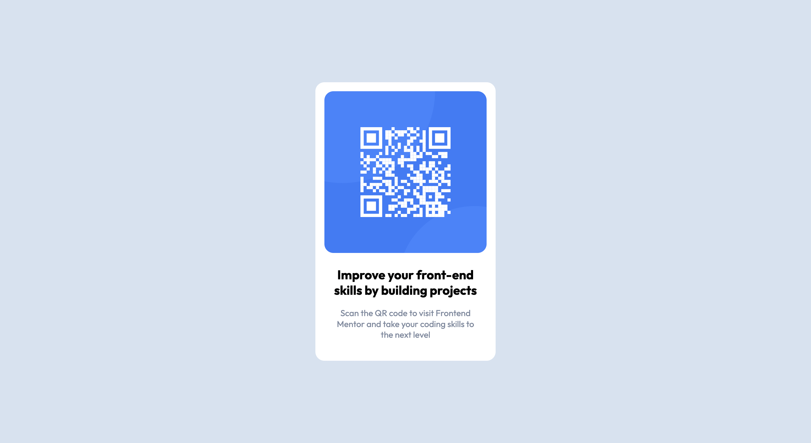

# Frontend Mentor - QR code component solution

This is a solution to the [QR code component challenge on Frontend Mentor](https://www.frontendmentor.io/challenges/qr-code-component-iux_sIO_H). Frontend Mentor challenges help you improve your coding skills by building realistic projects. 

## Table of contents

- [Overview](#overview)
  - [Screenshot](#screenshot)
  - [Links](#links)
- [My process](#my-process)
  - [Built with](#built-with)
  - [What I learned](#what-i-learned)
  - [Continued development](#continued-development)
  - [Useful resources](#useful-resources)
- [Author](#author)

**Note: Delete this note and update the table of contents based on what sections you keep.**

## Overview

### Screenshot

#### Desktop view

#### Mobile view

### Links

- Solution URL: [FrontendMentor Solution](https://www.frontendmentor.io/challenges/qr-code-component-iux_sIO_H/hub/qr-code-component-jraY3abFu0)
- Live Site URL: [Live site URL](https://reykjabik.github.io/qr-code-component/)

## My process

### Built with

- Semantic HTML5 markup
- CSS custom properties
- Flexbox
- SCSS
- Mobile-first workflow

### What I learned

More than learned, this was an attempt to remember whatever I learned about basic web development and SCSS last summer. It was all foggy in my mind and I wanted to start again by doing this simple challenge.

### Continued development

I definitely need to work on the structuring of the website, the way I group elements and so on. I feel my CSS is a bit messy and that I could do this much better on a second round if I think over the structure again.

## Author

- Frontend Mentor - [@reykjabik](https://www.frontendmentor.io/profile/reykjabik)
